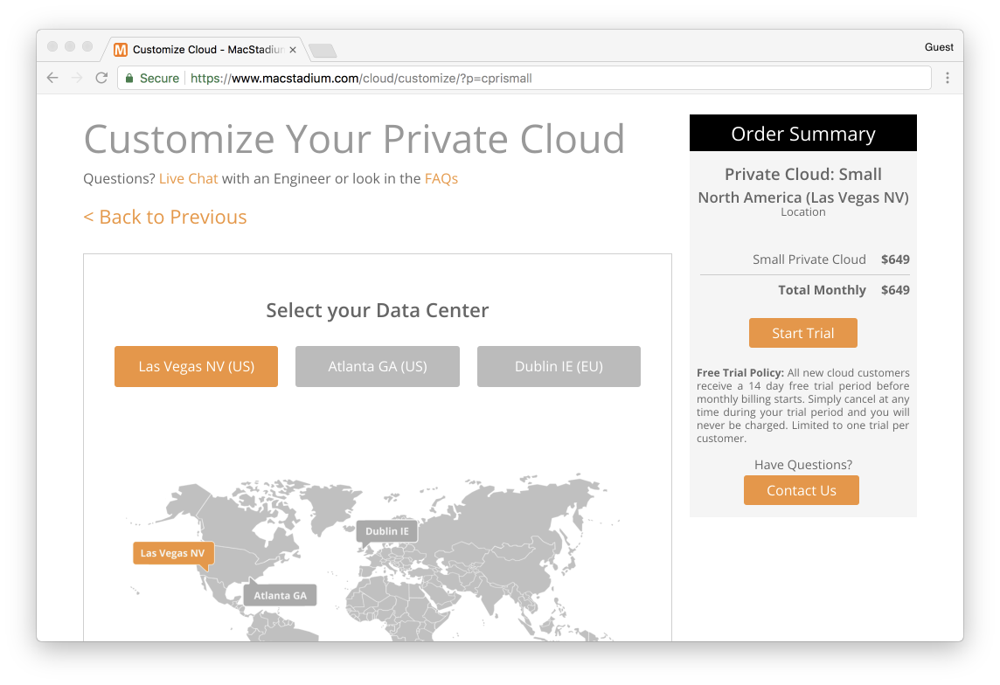
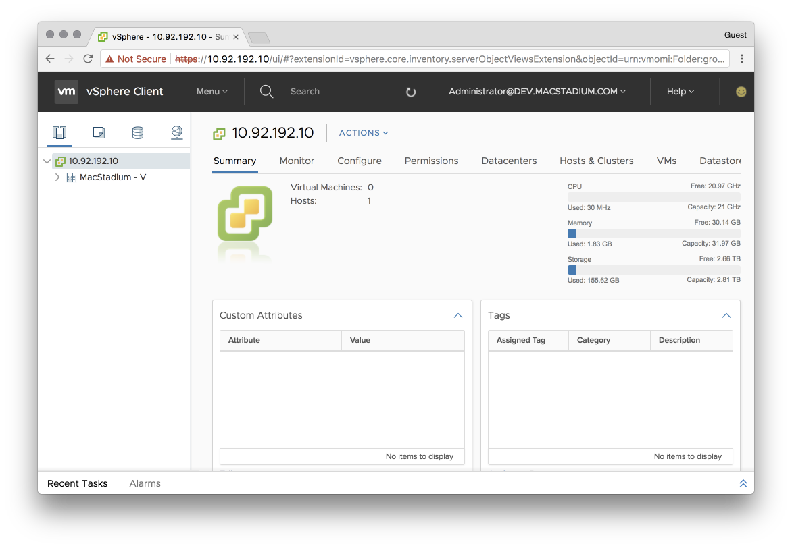
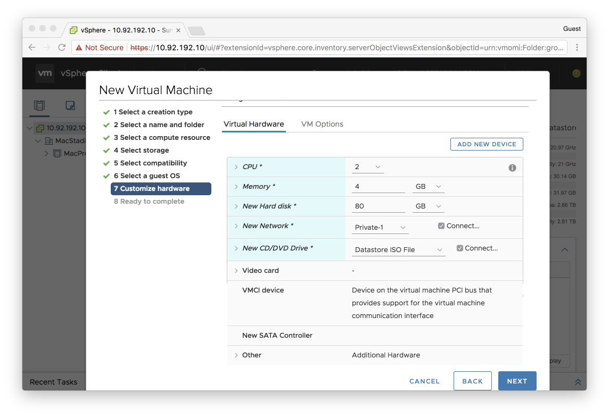
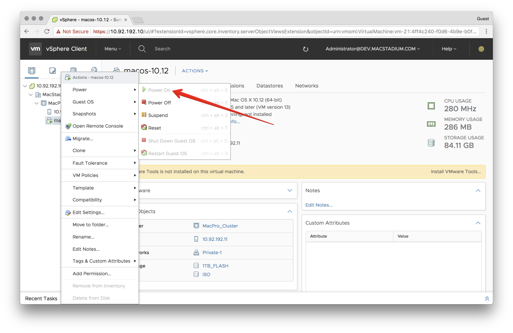

# How to use MacStadium's Private Cloud for Continuous Integration for macOS or iOS projects

In this article, we'll get started with setting up a MacStadium Private Cloud to run builds for your macOS or iOS project. We'll be using a [Private Cloud](https://www.macstadium.com/cloud/), which is powered by VMware on dedicated Mac hardware.

Continuous Integration (CI) is a term in modern development for ensuring that your code passes a series of tests (integration tests, historically) on every code check-in. This means having a central point where your code can be checked and have the results reported back to you. This allows teams to iterate rapidly and collaborate on their Source Code Management (SCM) platform of choice (e.g Github, Gitlab or Bitbucket).

In the Linux world, CI is easier than the Mac world, as there are tools like Docker to provide isolated runtime environments for repeatable tests. In the Mac world, this is harder, as there aren't native containerization tools. We do however have virtualization tools, like VMware (see [What's the difference between containers and virtual machines](#whats-the-difference-between-containers-and-virtual-machines) for more details). This means that on top of MacStadium's physical Mac hosts, we can create several virtual macOS machines and use them as targets for running our tests on.

## Choosing a Plan



Virtualization means you can run more than one virtual host per physical machine, which means you are dividing up the resources of a single host into several. This means you need to choose the amount of physical machines you need based on how many concurrent builds you want to do. The more concurrent builds you do, the less time developers are waiting for builds. Beyond concurrency, you will need to run a virtual machine for each version of macOS that you are targeting.

A good rule of thumb is 2-3 virtual machines per physical host.

To get started:

1. Pick the plan that suits you: https://www.macstadium.com/cloud/
1. Choose the data center closest to you
1. Choose "Start Trial" and create an account

MacStadium will provision your new environment and email you at the account you nominated. Typically this takes 2-3 working days.

## Connecting to Your Cloud

The provisioning team at MacStadium will create a ticket that you can access in https://portal.macstadium.com with your IP Plan document (Excel format, but Google Docs imports it if required).

To access your environment, you will first need to connect via a VPN:

* On Windows, see [Configuration Cisco IPSEC VPN in Windows using Shrew VPN Client](https://discuss.macstadium.com/t/configuration-cisco-ipsec-vpn-in-windows-using-shrew-vpn-client/27)
* On macOS, see [How to setup a MacStadium Cisco IPSEC VPN connection](https://www.macstadium.com/blog/how-to-setup-a-cisco-vpn-connection-in-mac-os-x-and-windows/)

## Connecting to vSphere Web Client

Now that you've connected to VPN, you can connect to your vCenter instance. We will use the web interface, although there are native options for Windows and macOS.

1. Click the "vCenter Web Client" url in "Step 2: vCenter Login" in your IP Plan.
1. Copy and paste in the username and password, being careful to not include whitespace at the end of the fields

If you have vSphere 6.5+ then you can use the HTML5 version by changing your login url to `/ui`, for instance https://10.92.192.10/ui.

Otherwise, if you are using the flash version and you receive a white screen, you might need to whitelist the site in your Browser. In Chrome, this is under [Content Settings > Flash](chrome://settings/content/flash?search=flash). You will need to add an exception under allow for the IP address of your vCenter host (e.g 10.92.192.10). Then refresh the original page and it should load.

You should now be able to see your Private Cloud!



## Creating a Virtual Machine

Depending on the plan you selected, you will have a different amount of physical hosts, but these are all represented as part of your "Cluster", which exists in your "Data center" in vSphere. As you grow, this lets you manage multiple networks or groups of hosts within the one interface. For now, we will be dealing with the cluster that represents your private cloud, named something like "MacPro_Cluster".

We are going to create a single virtual machine running macOS:

1. Right-click on the Cluster in the Navigator and select "New Virtual Machine"
1. Select "Create a new virtual machine" and Next
1. Choose a name, e.g "macOS-10.12" and Next
1. In "Select a compute resource", click Next. If you are prompted, you might need to select a specific host to deploy on if your cloud doesn't have [DRS Mode][] turned on. This just means that your VM will run on that specific host vs VMware determining a host for you.
1. Select the datastore for your VM's files, generally you will only have one of these. Select Next.
1. Select the default presented for Compatibility and Next.
1. Select Guest OS Family `Other` and Guest OS Version `Apple Mac OS X 10.12 (64-bit)`. Don't worry that this won't match the actual macOS version, we only need one that is close.
1. Select the follwing virtual hardware settings before selecting Next:
    * CPU: `2`
    * Memory: `4GB`
    * New Hard Disk: `80GB`
    * New Network: `Browse > Private-1` (The name of your private range in your IP Plan)
    * Expand `CPU` and select "Expose hardware assisted virtualization to the guest OS" (in case you want a nested VM)
    * New CD/DVD Drive: `Datastore ISO File`. Select `ISO > OSX > macOS_Sierra.iso`. Ensure that `Connect` is ticked.
1. Check your summary looks correct, and then Finish.



## Installing macOS

You should now have a virtual machine listed within your Cluster in the web interface. This will take about 30 minutes.



1. Right-click on the virtual machine and select `Power > Power On`.
1. Click on the virtual machine and then click on the preview image. You should now see the macOS installer starting up.
1. Get up to the "Install macOS" screen. If you only see the DVD image, you will need to select `Utilities > Disk Utility` from the menu
    1. Select "VMware Virtual SATA Hard Drive Media"
    1. Select "Erase" with defaults
    1. Close Disk Utility and select "Untitled"
1. Wait for the installer to run
1. When at "How Do You Connect", select `Local network (Ethernet)`
1. Select TCP/IP Connection Type `Manually` and enter the following details before Next:
    1. IP Address: `10.254.50.2` (The first address from your IP Plan under the Private-1 range)
    1. Subnet Mask: `255.255.255.0`
    1. Router Address: `10.254.50.1`
    1. DNS Servers: `8.8.8.8, 8.8.4.4` (Google's DNS servers)
1. Skip Location Services, Apple ID
1. Create an Account and note the account details. For this demo, we will use `buildkite` with a password of `buildkite`
1. Set a timezone to your local time

You should now be on the desktop, you have a working Mac virtual machine!

## Install VMware Guest Tools

VMware has a set of tools that must be installed on macOS. These get mounted via a virtual CD drive.

ISO Download and Upload to vCenter:

1. Download a recent version of VMware Tools ([10.0.1 is here]([VMware Tools 10.0.1 directly](http://softwareupdate.VMware.com/cds/vmw-desktop/fusion/10.0.1/6754183/packages/com.VMware.fusion.tools.darwin.zip.tar))) and unzip it so that you have a `darwin.iso`
1. Login into vCenter
1. Use your storage tabs to navigate to your datastore
1. Browse your Datastore, you can upload the ISO to the root folder or create an ISO folder

Install Directions:

1. Shutdown your machine from within macOS
1. From the web interface, right-click on your virtual machine and select `Power > Power Off`
1. Right click on your virtual machine and select `Edit Settings`
1. Change CD/DVD Drive 1 to `Datastore ISO File` and select the ISO you uploaded.
1. Right click on your virtual machine and select `Power > Power On`
1. Go back into the desktop of the virtual machine and log in after the reboot
1. Install the VMware Tools when prompted

## Installing Build Tools

Now that you have a working machine, you will need to install the basic software that you will need to run builds. You can either do this via VNC or via the Web Console, or if you enable Remote Login in the macOS settings, you can SSH in. This guide explains the latter approach as it's easier to do repeatably and automate as you scale up.

You can access your host via SSH from your desktop provided you have the VPN connected:

```bash
ssh buildkite@10.254.50.2
```

All further terminal commands in this guide will assume you are logged into the above.

### Install Homebrew

Homebrew is a package manager for macOS and used for installing the various tools we need. Read more about it at https://brew.sh/. This step will take about 15 minutes. You will be required to put in your password at least once.

Lots of tooling requires a modern Ruby installed (fastlane for instance), so we also update our system Ruby:

```bash
/usr/bin/ruby -e "$(curl -fsSL https://raw.githubusercontent.com/Homebrew/install/master/install)"
brew install rbenv ruby-build

# Add rbenv to bash so that it loads every time you open a terminal
echo 'if which rbenv > /dev/null; then eval "$(rbenv init -)"; fi' >> ~/.bash_profile
source ~/.bash_profile

# Install Ruby
rbenv install 2.4.2
rbenv global 2.4.2
ruby -v
```

### Install XCode

You can install XCode via the App Store manually if required, but we recommend [Xcode::Install](https://github.com/KrauseFx/xcode-install), a tool for installing and managing multiple versions of XCode. This allows you to use the one machine for multiple versions and swap between them, similar to the approach we took in the previous step for Ruby:

```bash
gem install xcode-install
rbenv rehash
xcversion install 9.0.1
sudo xcode-select -s /Applications/Xcode.app
```

## Run a Fastlane Test Build
Now you have a working Xcode environment! Next up we will test that we can run automated builds on it, using [Fastlane][] and a demo application from [Buildkite][].

```bash
git clone https://github.com/buildkite/buildkite-fastlane-demo.git
cd buildkite-fastlane-demo
bundle install
bundle exec fastlane test
```

This should run the unit tests and some integration tests. Congratulations, you have a working build environment!

## Next Steps

Now that you have a base operating system, you can either create multiple virtual machines with the system variations you require. You can convert your VM to a Template and then use that template to create multiple VM's that you can throw away once you no longer require them:

1. Stop VM if running
1. Right click on VM > Sekect "Convert to Template"

From that point you can create new VM's from that template.

## Manage your macOS builds with Buildkite

Buildkite is a service that provides orchestration for managing your builds. It connects to Github, Gitlab or Bitbucket and will trigger a build when you push changes to that service. The builds run on the hardware you provide via a software agent. You can easily install the agent on the VM we created above. See https://buildkite.com/docs/agent/osx.

## FAQ

### What's the difference between containers and virtual machines?

From https://en.wikipedia.org/wiki/Virtual_machine:

> In computing, a virtual machine (VM) is an emulation of a computer system. Virtual machines are based on computer architectures and provide functionality of a physical computer. Their implementations may involve specialized hardware, software, or a combination.

VMWare provides virtual machines, which allows you to run different operating systems as the operating system interacts with virtualized hardware. Virtual Machines can be many gigabytes as they need to have the entire operating system and all the drivers and related software in the image and can take 10-20 seconds to boot.

Containers (otherwise known as [Operating System Virtualization](https://en.wikipedia.org/wiki/Operating-system-level_virtualization)) is a more lightweight alternative that creates multiple isolated environment within an existing operating system and kernel. Ecosystems like [Docker][] use copy-on-write filesystems to allow for completely ephemeral, isolated environments to be created to run a single process. The advantage to containers is that they start nearly instantly and the filesystem snapshots are much smaller as they don't have to contain the entire operating system kernel. The downside is they are limited to the same operating system and kernel as the host environment.


[Buildkite]: https://buildkite.com/
[Fastlane]: https://fastlane.tools/
[Docker]: https://docker.com
